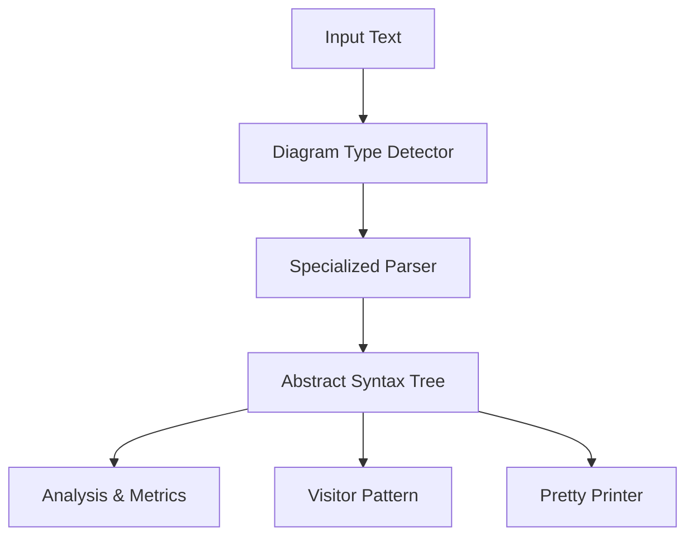

# Introduction to Mermaid Parser

**Welcome to the mermaid-parser documentation!** 

mermaid-parser is a high-performance Rust library that transforms Mermaid diagram syntax into structured, analyzable data. It bridges the gap between diagram text and programmatic analysis.

## What is Mermaid Parser?

Mermaid Parser is a comprehensive Rust crate that provides:

- **🚀 Blazing-fast parsing** of Mermaid diagram syntax using advanced parser combinators
- **🎯 Universal diagram support** for all major Mermaid diagram types
- **🔍 Intelligent error analysis** with context-aware suggestions
- **🧪 Comprehensive testing matrix** ensuring reliability across edge cases
- **📊 Built-in metrics system** for diagram complexity analysis
- **🔄 Extensible architecture** supporting custom diagram types

## Design Philosophy

mermaid-parser follows a modular, performance-focused approach:

- **Specialized Parsers**: Each diagram type has a dedicated parser optimized for its syntax
- **Smart Error Recovery**: Advanced error handling with helpful suggestions for common mistakes
- **Efficient Tokenization**: Context-aware lexical analysis for optimal performance
- **Semantic Validation**: Goes beyond syntax to validate diagram logic and structure

## Key Features

### 🎯 Complete Diagram Coverage

Support for 20+ diagram types including:
- Flowcharts & Sequence diagrams
- Class & State diagrams  
- Sankey & Timeline visualizations
- Architecture & C4 diagrams
- And many more specialized formats

### ⚡ Performance Optimized

- Zero-copy parsing where possible
- Parallel tokenization for large inputs
- Memory-efficient AST representation
- Benchmarked against real-world datasets

### 🛡️ Error Resilience

- Detailed error messages with line/column information
- Contextual suggestions for common syntax mistakes
- Recovery strategies for partial parsing
- Integration with development tools

### 🔧 Developer Experience

- Comprehensive documentation with examples
- Type-safe API design
- Visitor pattern for AST traversal
- Extensive test coverage

## Architecture Overview

The parser operates through a clear pipeline:

1. **Type Detection**: Automatically detects diagram type from input patterns
2. **Specialized Parsing**: Routes to optimized parser implementations
3. **AST Construction**: Builds validated Abstract Syntax Tree representations
4. **Analysis Layer**: Provides metrics, validation, and transformation capabilities

## Getting Started

Ready to integrate diagram parsing into your project? Let's begin with the [Getting Started](./getting-started.md) guide.

## Documentation Navigation

- **[User Guide](./getting-started.md)**: Learn the fundamentals and common use cases
- **[Advanced Usage](./ast-analysis.md)**: Explore sophisticated parsing techniques
- **[Parser Reference](./parser-architecture.md)**: Deep dive into parser implementations
- **[API Reference](./api/core.md)**: Complete API documentation
- **[Development](./contributing.md)**: Contributing and development guidelines

---

> 💡 **Pro Tip**: The more you explore different diagram types and parsing patterns, the better you'll understand mermaid-parser's capabilities!